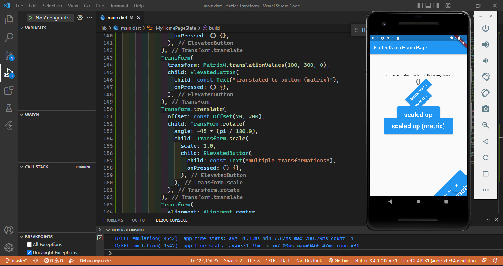
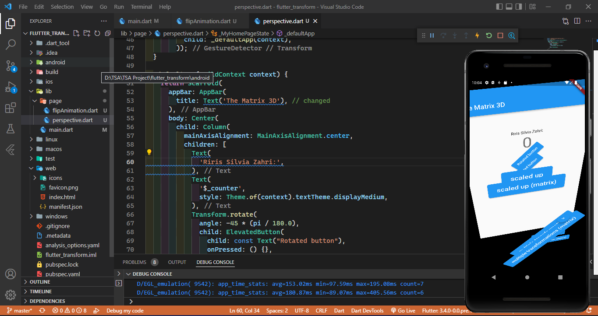
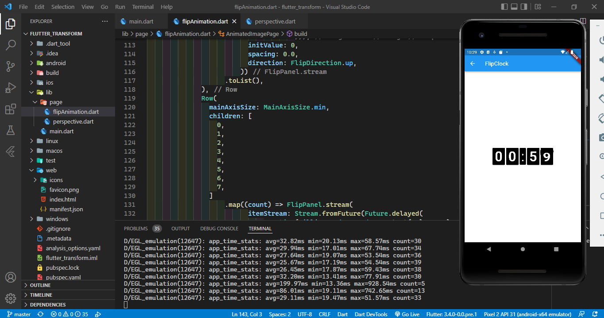
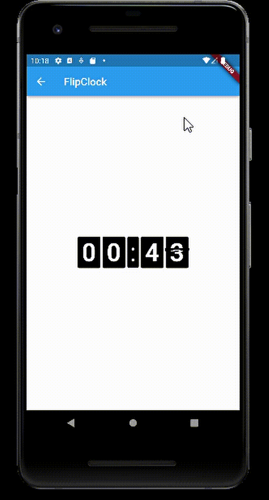
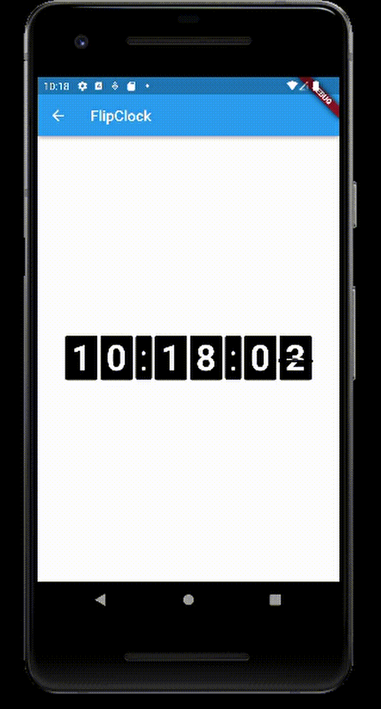

# flutter_transform

A new Flutter project.

## Praktikum Manipulasi Widget
Tambahkan library dart:math pada file main.dart
```
import 'dart:math';
```



## Tugas 2 perspektif di flutter
Buatlah folder dan file dart baru lalu praktikkan kode yang ada di tautan ini terkait perspektif di flutter!



## Tugas 3 membuat flip animasi 3D
- Tetap di project yang sama, buatlah folder dan file dart baru lalu praktikkan kode yang ada di tautan ini untuk membuat flip animasi 3D!
- Menambahakan Library flip
```
flutter pub add flip_panel
```



